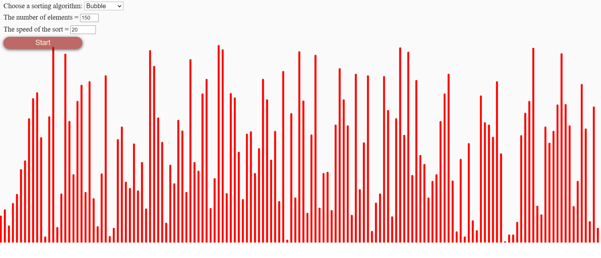

# Sorting_Algorithms_JS
# [Demo](https://zazazaza4.github.io/Sorting_Algorithms_JS/)
Sorting algorithms visualization in JavaScript | Uses p5.js



### Bubble sort
```js
function sortArrayBubble(array = []) {
  for (let i = 0; i < array.length; i++) {
    for (let j = 0; j < array.length; j++) {
      if (array[j] > array[j + 1]) {
        let temp = array[j];
        array[j] = array[j + 1];
        array[j + 1] = temp;
      }
    }
  }
  return array;
}
```

### Selection sort
```js
function sortArraySelection(arr = []) {
  let min;

  for (let i = 0; i < arr.length; i++) {
    min = i;

    for (let j = i + 1; j < arr.length; j++) {
      if (arr[j] < arr[min]) {
        min = j;
      }
    }

    if (min !== i) {
      [arr[i], arr[min]] = [arr[min], arr[i]];
    }
  }

  return arr;
}
```

### Insertion sort
```js
function sortArrayInsertion(arr) {
  for (let i = 1; i < arr.length; i++) {
    for (let j = i - 1; j > -1; j--) {
      if (arr[j + 1] < arr[j]) {
        [arr[j + 1], arr[j]] = [arr[j], arr[j + 1]];
      }
    }
  }
  return arr;
}
```
